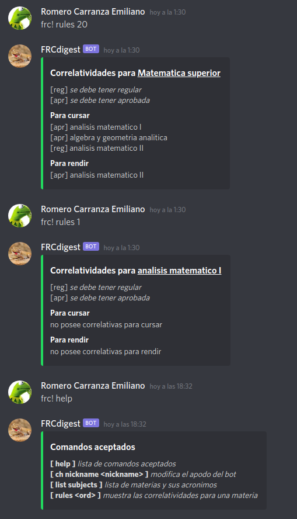

# Participar en el proyecto

---

## Un vistazo

---

## Tu primer _issue_

De entre la lista de [issues activos](https://github.com/RomeroCarranzaEmiliano/FRCdigest/issues), aquellos que son
considerados aptos para recién iniciados en el proyecto, llevan una etiqueta de *buen primer issue*

Si tenés una sugerencia o encontraste algún bug o problema, también podés simplemente crear un nuevo issue

---

## Con quién hablar

Si tenés dudas sobre cómo sumarte al proyecto, podés consultar por 
[gitter](https://gitter.im/FRCdigest-crew/community?utm_source=share-link&utm_medium=link&utm_campaign=share-link) 

Si estás en el servidor de discord de Sistemas, podés enviar un mensaje en ese mismo servidor etiquetando:
`@Romero Carranza Emiliano`

---

## Cómo lo hacemos
...descripción del proceso de desarollo

---