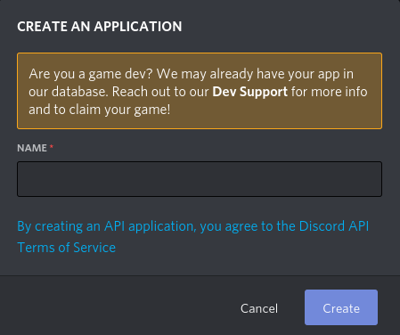
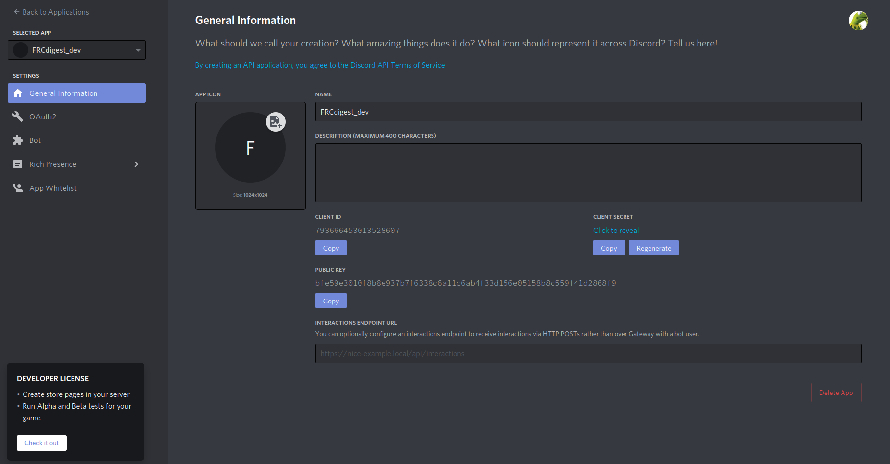
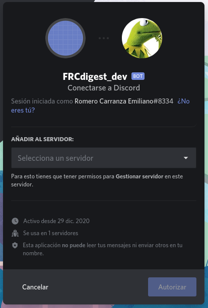
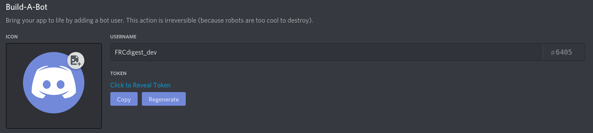

# Principal

---

## FRCdigest
Un bot de discord y aplicación web open source con la misión de otorgar a los estudiantes de Ing. en Sistemas de 
Información de la UTN FRC, información digerida y útil, para facilitar la vida académica. 

---

<!--
## Un vistazo

...aquí debe ir una descripción más extensa de la aplicación, con imagenes que ilustren

---
-->

## Soporte

La base de datos de la aplicación soporta los siguientes planes:

* Ing. en Sistemas de Información
    * plan 2008

---

## Comandos

* `frc! help` mensaje de ayuda, muestra una lista de los comandos soportados
* `ch nickname <nuevo_apodo>` modifica el apodo del bot por *nuevo_apodo*
* `list subjects` muestra una lista de materias junto con su ord. y acrónimo(si tiene)
* `rules <ord>` muestra las correlativas para cursar y rendir la materia de *ord* ingresada

---

## Cómo empezar

### Creación de la aplicación y bot en el portal de discord

Una vez que ya se tiene una cuenta de [discord](https://discord.com/) y un servidor creado en la aplicación, es 
necesario entrar al [portal para desarrolladores de discord](https://discord.com/developers/applications). Dentro del 
portal hay que darle al botón *New Aplication* o *Nueva Aplicación*.

*debería aparecer esto en pantalla*

Se debe ingresar el nombre de la aplicación(*FRCdigest_dev*) y luego oprimir el botón *create* o *crear*.

En este portal es necesario ir a la opción de *bot* que se puede ver a la izquierda, luego se debe crear un bot para la
aplicación. Es importante que solo la opción de *public bot* esté activada, de lo contrario en los próximos pasos se 
pueden presentar errores.

Por último hay que ir a la sección *OAuth2*, marcar la casilla de *bot* y copiar el link generado.

Entrando al link a través del navegador, nos va a dar la opción de agregar el bot a nuestro servidor de discord en 
*seleccione un servidor*

Oprimiendo el botón *Autorizar*, nuestro bot será agregado a nuestro servidor.

**¡Ahora ya se tiene un servidor y bot para probar nuestro desarrollo!**

### Ejecutar bot

Ya con nuestra app, bot y servidor de desarrollo, es momento de ejecutar nuestro bot para ver si todo funciona 
correctamente.

Es necesario en el portal de desarrollador de discord a la sección de bot y copiar el token generado por discord.

Este token, debemos pegarlo en el archivo *FRCdigest/app/bot/.env* de la forma:

    TOKEN=nuestro_token_copiado_desde_el_portal_de_discord

Ahora es necesario hacerle saber al bot que debe ejecutar el bot con dicho token, para que no trate de buscar el token
en las *environment variables* como haría en un entorno de producción. Para esto, vamos a *FRCdigest/app/bot/config.yml*
 y cambiamos:

    environment: prod

por:

    environment: env

Listo, ahora nuestro bot está configurado para un entorno de desarrollo. Abrimos una terminal en la carpeta del
repositorio, donde podemos ver la siguiente estructura de archivos:

    /FRCdigest
        /app
        /docs
        /DOCUMENTATION
        ...

Procurando que el directorio de trabajo sea */FRCdigest*, ejecutamos:

    python3 -m app.bot

Si todo es correcto, en unos pocos segundos el bot se ejecutará con exito y podremos verlo activo en nuestro servidor
de discord. Para verificar podemos escribir en chat del servidor el mensaje

    frc! help

y el bot debería contestar con un mensaje de ayuda mostrando los comandos soportados.

---

## Necesito ayuda

En caso de cualquier duda o sugerencia, podés hablar por 
[gitter :)](https://gitter.im/FRCdigest-crew/community?utm_source=share-link&utm_medium=link&utm_campaign=share-link)

---