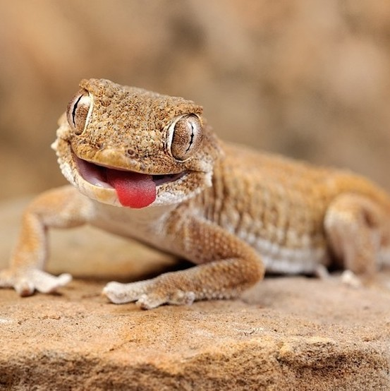

<!-- acá deberían ir botones sobre el estado del repositorio 
    - boton de build
    - boton coverage
    - interacciones por mes
    - version activa en discord
    - version latest
    - licencia
    - chat
-->
# FRCdigest

Un bot de discord y aplicación web open source con la misión de otorgar a los estudiantes de Ing. en Sistemas de
Información de la UTN FRC, información digerida y útil, para facilitar la vida académica.

# Recursos

### Documentación

<!-- acá debería estar el link a la documentación -->

### Guías para el desarrollador

<!-- acá debería estar el link a las guías para el desarrollador -->

### FAQ's (Preguntas frecuentes)

<!-- acá debería estar el link a las FAQ's -->

